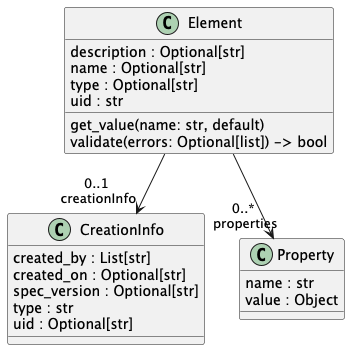
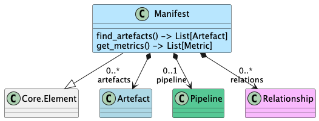
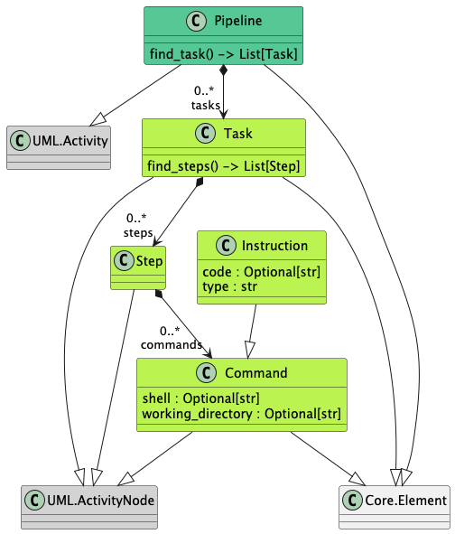

# DSL4Pipelines

## Objectives
 Pour favoriser une démarche systématique de diffusion transparente et responsable des modeles de machine learning, 
 nous proposons une approche basée sur la construction d'un manifeste de pipeline de construction du modèle. 
 
Ce manifeste décrit les étapes de construction du modèle, les composants utilisés et produits (datasets, modèles pré-entraînés, etc.) et les relations entre ces étapes et composants.

Un système de validation permet de vérifier la conformité du manifeste à des règles de validation définies par l'utilisateur, afin d'identifier les points d'amélioration pour rendre le pipeline plus transparent et responsable.

## Metamodele structure

### Element : the root element 
Dans l'esprit des SBOM, le manifeste de pipeline est structuré autour d'un élément racine 
qui contient les informations générales que les composants du manifeste doivent compléter.

### The Manifest
The manifest is the main component of the DSL4Pipelines. 
It contains all the information about the way the ML model was built, i.e.
the pipeline of construction of the model, the artefacts produced and used during the construction of the model, 
and the relationships between these steps and components.

### The pipeline

## Demontration of DSL4Pipelines

Voir dans le fichier [demo.py](tests/demo/demo.py)

### Construction d'un manifeste dans le language DSL4Pipelines
Cette étape n'est pas obligatoire pour la démonstration.
Elle permet si besoin de construire un manifeste à partir de zéro, 
en utilisant les éléments du métamodèle, pour ensuite le valider et le visualiser.

[Iris Manifest](tests/examples/NotebookIRISManifest.py)
  - _test_build_manifestFromNBonIrisClassification_ construit le manifeste. 
  - En lançant le test:  [fichier yaml généré](tests/targets/manifests/iris_manifest.yaml)

[GPT2 Manifest](tests/examples/test_NanoGPTV0.py)

### Validation d'un manifeste de construction d'un SML : un fichier yaml qui décrit les étapes du pipeline et leurs relations

   1. Definition de la manière dont le modele a été construit :
      - présentation du fichier yaml : manifeste du pipeline [nanoGPT_manifest.yaml](tests/examples/sources/nanoGPT_manifest.yaml)
      - présentation du code de construction du pipeline [NanoGPTV0.py](tests/examples/NanoGPTV0.py) (et plus specifiquement pour générer le yaml : _test_to_yaml_and_reverse_nanoGPT_ )
     
   2. Visualisation mermaid du manifeste[nanoGPT_manifest2.mmd](tests/examples/outputs/nanoGPT_manifest2.mmd) 
   3. vérification de la validité du manifeste 
      - choix des [règles](./src/tools/queries/rules.py)
      - production du rapport de validation [report_step2.txt](tests/examples/outputs/report_step2.txt)
      <code>
        [RuleReport(ruleMetadata=RuleMetadata(name='Dataset and Model Presence', weight=1.0, func=<function check_dataset_and_model_presence at 0x105d2c040>), results=[EvaluationResult(label='Availability of dataset', success=True, score=1.0, evidence='Number of datasets: 2'), EvaluationResult(label='Availability of model', success=True, score=1.0, evidence='Number of ML models: 1')], avg_score=1.0, status='Green'), RuleReport(ruleMetadata=RuleMetadata(name='French Readiness', weight=1.0, func=<function check_french_support at 0x105d2c1a0>), results=[EvaluationResult(label='Dataset contient du français', success=False, score=0.0, evidence='Langues trouvées: [[], []]'), EvaluationResult(label='Performance sur benchmark FR', success=False, score=0.0, evidence='Aucun benchmark de performance en français trouvé')], avg_score=0.0, status='Red')] 
      </code>
      
        🟢 Dataset and Model Presence | Score: 1.00 |  
        Details:  
        ✅ Availability of dataset: Number of datasets: 2 (score: 1.00)  
        ✅ Availability of model: Number of ML models: 1 (score: 1.00)  
        🔴 French Readiness          | Score: 0.00 |  
        Details:  
        ❌ Dataset contient du français: Langues trouvées: [[], []] (score: 0.00)  
        ❌ Performance sur benchmark FR: Aucun benchmark de performance en français trouvé (score: 0.00)  
      
   4. Modification du manifeste pour résoudre des erreurs de validation 
   5. Re-vérification de la validité du manifeste après modification

          [RuleReport(ruleMetadata=RuleMetadata(name='Dataset and Model Presence', weight=1.0, func=<function check_dataset_and_model_presence at 0x105d2c040>), results=[EvaluationResult(label='Availability of dataset', success=True, score=1.0, evidence='Number of datasets: 2'), EvaluationResult(label='Availability of model', success=True, score=1.0, evidence='Number of ML models: 1')], avg_score=1.0, status='Green'), RuleReport(ruleMetadata=RuleMetadata(name='French Readiness', weight=1.0, func=<function check_french_support at 0x105d2c1a0>), results=[EvaluationResult(label='Dataset contient du français', success=True, score=0.3999999999999999, evidence="Langues trouvées: [['french', 'english', 'german', 'spanish'], []]"), EvaluationResult(label='Performance sur benchmark FR', success=False, score=0.0, evidence='Aucun benchmark de performance en français trouvé')], avg_score=0.19999999999999996, status='Red'), RuleReport(ruleMetadata=RuleMetadata(name='Pureté Linguistique Globale', weight=2.0, func=<function rule_global_french_purity at 0x105d2c250>), results=[EvaluationResult(label='Pipeline Global', success=False, score=0.12, evidence='Analyse sur 2 datasets.')], avg_score=0.12, status='Red'), RuleReport(ruleMetadata=RuleMetadata(name='Ratio de Spécialisation', weight=1.0, func=<function rule_pollution_ratio at 0x105d2c300>), results=[EvaluationResult(label='Cohérence Linguistique', success=False, score=0.25, evidence='3 langues parasites détectées.')], avg_score=0.25, status='Red')]
          🟢 Dataset and Model Presence | Score: 1.00 |
          Details:
          ✅ Availability of dataset: Number of datasets: 2 (score: 1.00)
          ✅ Availability of model: Number of ML models: 1 (score: 1.00)
          🔴 French Readiness          | Score: 0.20 |
          Details:
          ✅ Dataset contient du français: Langues trouvées: [['french', 'english', 'german', 'spanish'], []] (score: 0.40)
          ❌ Performance sur benchmark FR: Aucun benchmark de performance en français trouvé (score: 0.00)
          🔴 Pureté Linguistique Globale | Score: 0.12 |
          Details:
          ❌ Pipeline Global: Analyse sur 2 datasets. (score: 0.12)
          🔴 Ratio de Spécialisation   | Score: 0.25 |
          Details:
          ❌ Cohérence Linguistique: 3 langues parasites détectées. (score: 0.25)

### Production d'un manifeste à partir d'un notebook jupyter

   1. Présentation du notebook jupyter qui décrit les étapes du pipeline et leurs relations
   2. Présentation du code de construction du manifeste à partir du notebook jupyter
   3. Visualisation mermaid du manifeste généré à partir du notebook jupyter [iris_manifest.mmd](tests/examples/outputs/iris_manifest.mmd)
   4. vérification de la validité du manifeste généré à partir du notebook jupyter
      - choix de règles
      - production du rapport de validation

### Transformation d'un SBOM en un manifeste de pipeline
Le SBOM décrit un Modèle et que le manifeste de pipeline décrit les étapes de construction du SML à partir de ces composants.

   1. Présentation du SBOM qui décrit les composants d'un SML
   2. Présentation du code de construction du manifeste à partir du SBOM
   3. Visualisation mermaid du manifeste généré à partir du SBOM
   4. vérification de la validité du manifeste généré à partir du SBOM
      - choix de (règles) (./src/tools/queries/rules.py)
      - production du rapport de validation
   5. Modification du SBOM pour résoudre des erreurs de validation
   6. re-génération du manifeste à partir du SBOM après modification
   7. re-vérification de la validité du manifeste après modification

### Filtrages de modèles par des règles personnalisées

### Definitions de règles de validation personnalisées

1. Présentation de la syntaxe pour définir des règles de validation personnalisées
2. Présentation d'exemples de règles de validation personnalisées
3. Application de règles de validation personnalisées à un manifeste de pipeline
4. Production du rapport de validation avec les règles personnalisées

## Perspectives

- Permettre de faire référence à d'autres fichiers yaml pour favoriser la réutilisation de composants